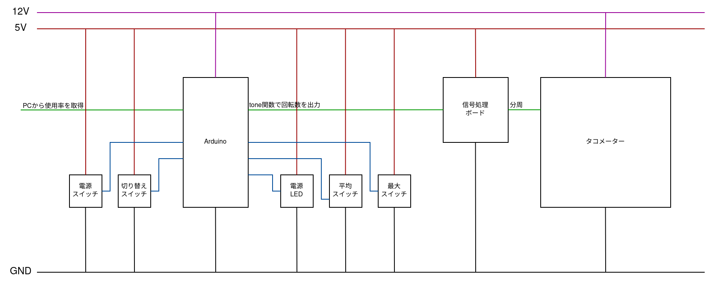

# タコメーターを使用してCPU使用率を表示させる
    Status: finished!  
    LastUpdate: 2023/07/12  

    
    
    

## 概要
エンジンの回転数を表示させる計器，タコメーターにcpuの使用率を表示させると画面の面積をとらないし針の角度で直感的に視認できるしかっこいいしいいんじゃねと思い制作しました．  
cpumonit.py パソコンで実行するプログラム  
sketch_jul04a.ino Arduinoに書き込むプログラム  
[動いている様子](https://twitter.com/Masuda_LetsGOOO/status/1677382760338694144?s=20)
  
### 動作環境
windowsパソコン（linuxやmacはUSBの接続方法が少し違うのでそのままでは動きません）  
2コア以上のIntelもしくはAMD社のCPU（マイナーなプロセッサだと使用率を読み取る機能がついていない場合があります）  
    
### 必要なもの
- Arduino(12Vの電源を使うのでUnoがいいかと思います)
- タコメータ(最大回転数が10000rpmだと直感的に 10000rpm=100% とわかりいいかと思います)
- 12V直流電源(秋月で800円で売ってるし隣のケーブルやさんで500円で売ってます)
- それなりのLED，それなりのユニバーサル基板，それなりのはんだ，はんだごて，ワイヤ，木板などなど

## 回路設計
  

### 説明
ざっくりこんな感じです．    
Pythonのライブラリpsutilを使ってCPUの使用率をシリアル通信します．  
その後Arudinoで受け取った値を少し整えてtone関数で出力します．  
この時，tone関数で出力できる方形波の最小周波数は32Hzであることに注目します．  
tone関数はスピーカーに任意の周波数の音を鳴らすための関数なので，人間の聞こえない32Hzより低い音はサポートしていないのですね．
タコメーターは，エンジンが1分間に何回転しているかを測定するものですが，tone関数の最小値である32Hzで考えてみると，60秒で1920回転．  
乗用車の多くは4ストロークなので，振動は半分の960回転．
これでは，CPUが忙しくない時（デスクトップで放置している時とか）でも，使用率9.6%となってしまいます．  
そこで，信号処理ボードで分周してあげましょう．  
一番らくなのは74HC04と74HC590を使うことでしょう，どちらも100円もしあいで入手できます．  
Arduinoのtone出力とtone出力を74HC04を通した負論理を74HC590の入力とし，任意の分周をすることです．  
tone関数は32Hzから65535Hzまでをカバーしているので，最大値に関してはほぼ考慮する必要はないでしょう．  
今回は8分周しました．つまりtoneの最小値32Hzを入力した場合，信号処理ポートを噛ませると4Hzにかわり，タコメーターの表示上では1%ちょっととなってまぁ妥協できる幅になりました．  
注意点として，GNDの共有はしておきましょう．  
タコメーターに接続する12Vと0V，方形波は表現する5Vと0V，この２つの0Vを同じ電位にしないとたぶんメーターが壊れます．  
それぞれの12Vや5Vは，それぞれのGNDに対してどのくらいの電位差を持っているかの表現にすぎないので，共通のGNDを持つことで，12Vと5Vの電位差を7Vにします．  

### 2023/09/29追記
多分4気筒とか6気筒とかはエンジンのピストンがn気筒分爆発するので，信号がn倍になってしまうのだと思います．
つまり2000rpmで動く4発エンジンは実際には電圧立ち上がりが1秒間に8000回行われているということです．

## 参考
[タコメータをPCに付けて動かしてみよう！](https://minkara.carview.co.jp/userid/819534/blog/45698199/)
